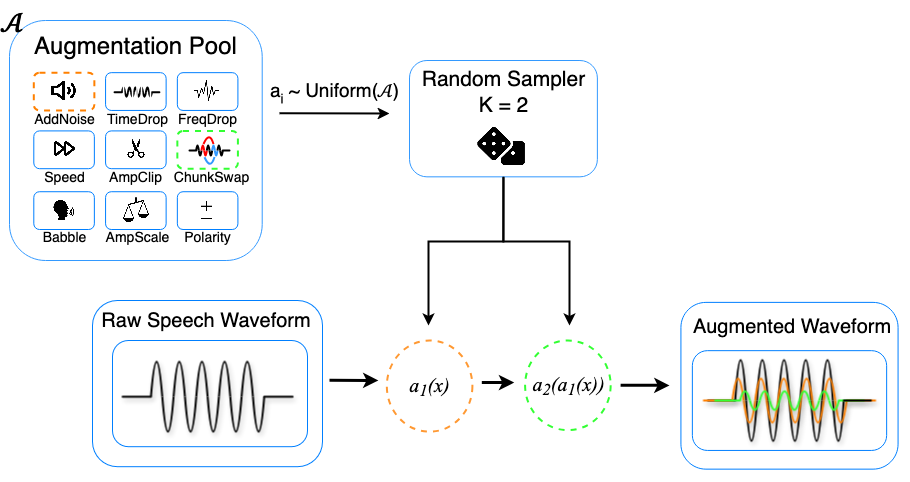

# wav2aug



A minimalistic PyTorch-based audio augmentation library for speech and audio processing. Applies two random augmentations per call with support for variable length waveforms and channel counts.

## Features

- **Minimal dependencies**: We only rely on PyTorch and torchcodec.
- **9 core augmentations**: amplitude scaling/clipping, noise addition, frequency dropout, polarity inversion, chunk swapping, speed perturbation, time dropout, and babble noise.
- **In-place operations**: All cpu augmentations are done in place.

## Installation

```bash
pip install torch
pip install torchcodec
```

## Quick Start

```python
import torch
from wav2aug import Wav2Aug

# Initialize augmenter
aug = Wav2Aug(sample_rate=16000)

# Process audio (supports [T] mono or [C, T] multi-channel)
waveform = torch.randn(8000)  # 0.5s at 16kHz
augmented = aug(waveform)
```

## Augmentation Types

- **Amplitude Scaling/Clipping**: Random gain and peak limiting
- **Noise Addition**: Environmental noise with SNR control
- **Frequency Dropout**: Spectral masking with random notch filters
- **Polarity Inversion**: Random phase flip
- **Chunk Swapping**: Temporal segment reordering
- **Speed Perturbation**: Time-scale modification
- **Time Dropout**: Random silence insertion
- **Babble Noise**: Multi-speaker background (auto-enabled with sufficient buffer)
